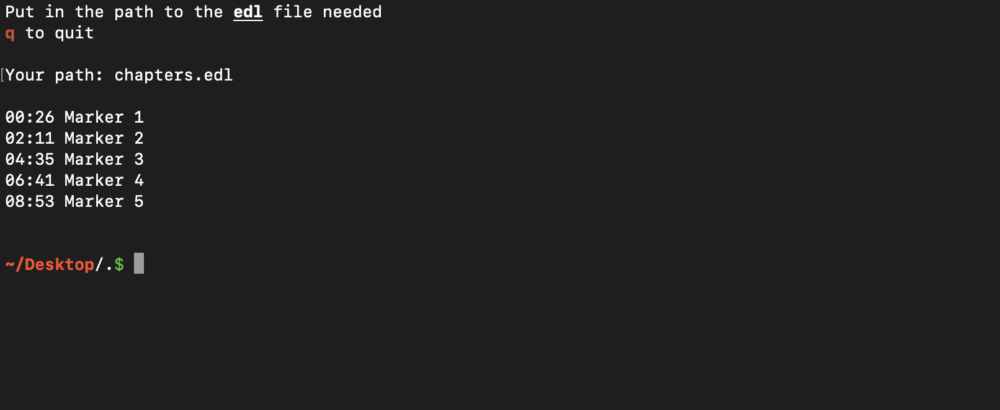

# DR EDL File Debloater For YTChapters
An EDL file debloater exported by Davinci Resolve for Youtube Chapters 

# How it works
What you need to do is to put the path that leads to the edl file to debloat and it'll do the work for you.

If it detects that the path being given isn't correct, it'll give feedback to the user.

